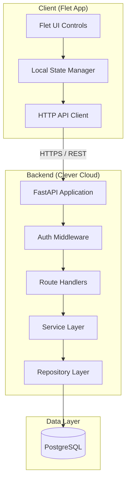
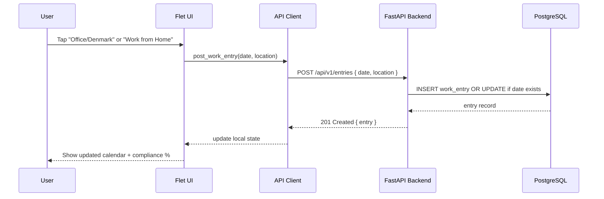
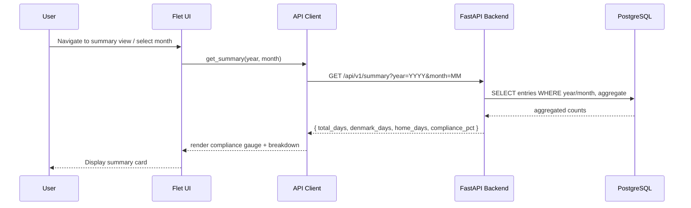
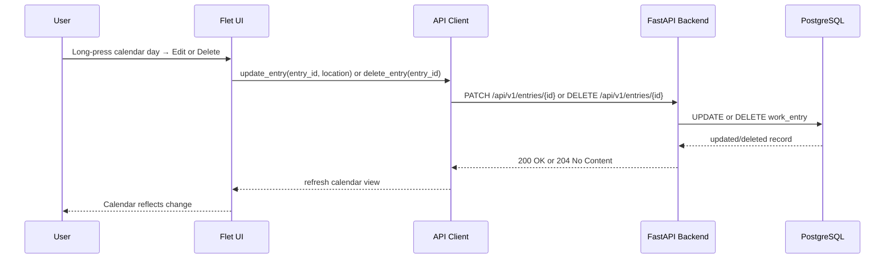
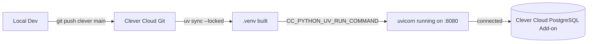

# Design Document: Work Location Tracker

## Overview

A cross-platform application built with Flet (Python/Flutter) that allows Swedish residents working in Denmark to log their daily work location — one of four types: "home" (Sweden), "denmark" (office), "vacation", or "sick" — and track compliance with the 50% Denmark work requirement.

The system consists of a Flet frontend app (desktop, web, mobile) that communicates with a FastAPI backend hosted on Clever Cloud, persisting data in a PostgreSQL database. A monthly/yearly summary view lets users see their compliance ratio at a glance.

---

## Architecture



---

## Sequence Diagrams

### Log a Work Day



### View Monthly Compliance Summary



### Edit / Delete an Entry



---

## Components and Interfaces

### Component 1: Flet Frontend App (`app/`)

**Purpose**: Cross-platform UI for logging and viewing work location data.

**Top-level structure**:
```python
app/
├── main.py              # ft.app() entry point
├── api_client.py        # HTTP client wrapper (httpx)
├── state.py             # AppState dataclass (in-memory)
├── views/
│   ├── home_view.py     # Calendar + quick-log buttons
│   ├── summary_view.py  # Monthly/yearly compliance summary
│   └── settings_view.py # API URL, user preferences
└── components/
    ├── calendar_grid.py # Custom Flet calendar component
    ├── compliance_bar.py# Progress bar showing Denmark %
    └── entry_tile.py    # Single day tile (color-coded)
```

**Interface — AppState**:
```python
@dataclass
class AppState:
    entries: dict[str, WorkEntry]  # key: ISO date "YYYY-MM-DD"
    selected_month: date
    compliance_summary: ComplianceSummary | None
    is_loading: bool
    error_message: str | None
```

**Calendar Color Coding**:

| Location | Color | `ft.Colors` constant |
|---|---|---|
| `"denmark"` | Red | `ft.Colors.RED_700` |
| `"home"` | Blue | `ft.Colors.BLUE_700` |
| `"vacation"` | Orange | `ft.Colors.ORANGE_700` |
| `"sick"` | Purple | `ft.Colors.PURPLE_700` |

**Interface — APIClient**:
```python
class APIClient:
    def __init__(self, base_url: str) -> None: ...

    async def get_entries(self, year: int, month: int) -> list[WorkEntry]: ...
    async def post_entry(self, date: str, location: WorkLocation) -> WorkEntry: ...
    async def patch_entry(self, entry_id: int, location: WorkLocation) -> WorkEntry: ...
    async def delete_entry(self, entry_id: int) -> None: ...
    async def get_summary(self, year: int, month: int) -> ComplianceSummary: ...
    async def get_annual_summary(self, year: int) -> AnnualSummary: ...
```

---

### Component 2: FastAPI Backend (`backend/`)

**Purpose**: Pure REST API, stateless, deployed on Clever Cloud.

**Top-level structure**:
```python
backend/
├── main.py              # FastAPI app factory + lifespan
├── config.py            # Settings (pydantic-settings, env vars)
├── database.py          # Async SQLAlchemy engine + session
├── models.py            # SQLAlchemy ORM models
├── schemas.py           # Pydantic request/response schemas
├── routers/
│   ├── entries.py       # CRUD endpoints for work entries
│   └── summary.py       # Aggregation / compliance endpoints
└── services/
    ├── entry_service.py # Business logic for entries
    └── compliance_service.py # 50% rule calculation
```

**Interface — Routers**:
```python
# entries router
router = APIRouter(prefix="/api/v1/entries", tags=["entries"])

@router.get("/", response_model=list[WorkEntryResponse])
async def list_entries(year: int, month: int, db: AsyncSession): ...

@router.post("/", response_model=WorkEntryResponse, status_code=201)
async def create_entry(body: WorkEntryCreate, db: AsyncSession): ...

@router.patch("/{entry_id}", response_model=WorkEntryResponse)
async def update_entry(entry_id: int, body: WorkEntryUpdate, db: AsyncSession): ...

@router.delete("/{entry_id}", status_code=204)
async def delete_entry(entry_id: int, db: AsyncSession): ...

# summary router
router = APIRouter(prefix="/api/v1/summary", tags=["summary"])

@router.get("/monthly", response_model=ComplianceSummaryResponse)
async def monthly_summary(year: int, month: int, db: AsyncSession): ...

@router.get("/annual", response_model=AnnualSummaryResponse)
async def annual_summary(year: int, db: AsyncSession): ...
```

---

### Component 3: Service Layer

**Purpose**: Business logic, isolated from HTTP and database details.

```python
class EntryService:
    def __init__(self, repo: EntryRepository) -> None: ...

    async def upsert_entry(self, date: date, location: WorkLocation) -> WorkEntry: ...
    async def get_entries_for_month(self, year: int, month: int) -> list[WorkEntry]: ...
    async def delete_entry(self, entry_id: int) -> None: ...

class ComplianceService:
    def calculate_monthly(self, entries: list[WorkEntry]) -> ComplianceSummary: ...
    def calculate_annual(self, entries: list[WorkEntry]) -> AnnualSummary: ...
    def is_compliant(self, summary: ComplianceSummary) -> bool: ...
```

---

### Component 4: Repository Layer

**Purpose**: All database I/O, async SQLAlchemy only.

```python
class EntryRepository:
    def __init__(self, session: AsyncSession) -> None: ...

    async def get_by_date(self, date: date) -> WorkEntry | None: ...
    async def get_by_month(self, year: int, month: int) -> list[WorkEntry]: ...
    async def get_by_year(self, year: int) -> list[WorkEntry]: ...
    async def create(self, entry: WorkEntryCreate) -> WorkEntry: ...
    async def update(self, entry_id: int, location: WorkLocation) -> WorkEntry: ...
    async def delete(self, entry_id: int) -> None: ...
```

---

## Data Models

### Database Model — `work_entry`

```python
class WorkEntry(Base):
    __tablename__ = "work_entries"

    id: Mapped[int] = mapped_column(Integer, primary_key=True, autoincrement=True)
    work_date: Mapped[date] = mapped_column(Date, nullable=False, unique=True)
    location: Mapped[str] = mapped_column(
        Enum("home", "denmark", "vacation", "sick", name="work_location_enum"),
        nullable=False
    )
    created_at: Mapped[datetime] = mapped_column(
        DateTime(timezone=True), server_default=func.now()
    )
    updated_at: Mapped[datetime] = mapped_column(
        DateTime(timezone=True), server_default=func.now(), onupdate=func.now()
    )
```

**Constraints**:
- `work_date` is unique — one entry per calendar day
- `location` is an enum: `"home"` | `"denmark"` | `"vacation"` | `"sick"`
- Both timestamps are managed by the database

---

### Pydantic Schemas

```python
class WorkLocation(str, Enum):
    HOME = "home"
    DENMARK = "denmark"
    VACATION = "vacation"
    SICK = "sick"

class WorkEntryCreate(BaseModel):
    work_date: date
    location: WorkLocation

    @field_validator("work_date")
    @classmethod
    def date_not_in_future(cls, v: date) -> date:
        if v > date.today():
            raise ValueError("Cannot log a future date")
        return v

class WorkEntryUpdate(BaseModel):
    location: WorkLocation

class WorkEntryResponse(BaseModel):
    id: int
    work_date: date
    location: WorkLocation
    created_at: datetime
    updated_at: datetime

    model_config = ConfigDict(from_attributes=True)

class ComplianceSummary(BaseModel):
    year: int
    month: int
    total_days: int
    denmark_days: int
    vacation_days: int
    sick_days: int
    home_days: int
    compliance_pct: float  # 0.0 – 100.0
    is_compliant: bool     # True when compliance_pct >= 50.0

class AnnualSummary(BaseModel):
    year: int
    total_days: int
    denmark_days: int
    vacation_days: int
    sick_days: int
    home_days: int
    compliance_pct: float
    is_compliant: bool
    monthly_breakdown: list[ComplianceSummary]
```

---

## Key Functions with Formal Specifications

### `ComplianceService.calculate_monthly(entries)`

```python
def calculate_monthly(self, entries: list[WorkEntry]) -> ComplianceSummary:
```

**Preconditions**:
- `entries` is a list (may be empty)
- All entries share the same year and month
- Each entry has a valid `location` of `"home"`, `"denmark"`, `"vacation"`, or `"sick"`

**Postconditions**:
- `total_days == len(entries)`
- `denmark_days + vacation_days + sick_days + home_days == total_days`
- `compliance_pct == ((denmark_days + vacation_days + sick_days) / total_days * 100)` when `total_days > 0`, else `0.0`
- `is_compliant == (compliance_pct >= 50.0)`
- Returns `ComplianceSummary` with all fields populated

**Loop Invariant** (when counting locations):
- At every iteration: `denmark_count + vacation_count + sick_count + home_count == number_of_entries_processed`

---

### `EntryService.upsert_entry(date, location)`

```python
async def upsert_entry(self, work_date: date, location: WorkLocation) -> WorkEntry:
```

**Preconditions**:
- `work_date <= date.today()` (no future dates)
- `location` is a valid `WorkLocation` enum value (`"home"`, `"denmark"`, `"vacation"`, or `"sick"`)

**Postconditions**:
- Exactly one `WorkEntry` row exists in the database for `work_date`
- The returned entry has `entry.work_date == work_date` and `entry.location == location`
- If a prior entry existed for that date, its location is updated; otherwise a new row is created

---

### `EntryRepository.get_by_month(year, month)`

```python
async def get_by_month(self, year: int, month: int) -> list[WorkEntry]:
```

**Preconditions**:
- `1 <= month <= 12`
- `year >= 2000`

**Postconditions**:
- Returns all entries where `work_date` falls within the given month/year
- Result is ordered ascending by `work_date`
- Returns an empty list if no entries exist for that month

---

## Algorithmic Pseudocode

### Core Compliance Calculation

```pascal
ALGORITHM calculate_compliance(entries)
INPUT:  entries — list of WorkEntry records for a given period
OUTPUT: summary — ComplianceSummary

BEGIN
  total    ← LENGTH(entries)
  denmark  ← 0
  vacation ← 0
  sick     ← 0
  home     ← 0

  FOR each entry IN entries DO
    ASSERT denmark + vacation + sick + home = number_of_entries_processed  -- loop invariant
    CASE entry.location OF
      "denmark":  denmark  ← denmark + 1
      "vacation": vacation ← vacation + 1
      "sick":     sick     ← sick + 1
      "home":     home     ← home + 1
    END CASE
  END FOR

  ASSERT denmark + vacation + sick + home = total

  compliant ← denmark + vacation + sick

  IF total > 0 THEN
    pct ← (compliant / total) * 100.0
  ELSE
    pct ← 0.0
  END IF

  compliant_flag ← (pct >= 50.0)

  RETURN ComplianceSummary(
    total_days     = total,
    denmark_days   = denmark,
    vacation_days  = vacation,
    sick_days      = sick,
    home_days      = home,
    compliance_pct = pct,
    is_compliant   = compliant_flag
  )
END
```

---

### Upsert Work Entry

```pascal
ALGORITHM upsert_entry(work_date, location)
INPUT:  work_date — calendar date (≤ today)
        location  — "home" | "denmark" | "vacation" | "sick"
OUTPUT: entry — persisted WorkEntry

BEGIN
  ASSERT work_date ≤ TODAY()
  ASSERT location ∈ {"home", "denmark", "vacation", "sick"}

  existing ← repository.get_by_date(work_date)

  IF existing IS NOT NULL THEN
    existing.location ← location
    entry ← repository.update(existing.id, location)
  ELSE
    entry ← repository.create(work_date, location)
  END IF

  ASSERT entry.work_date = work_date
  ASSERT entry.location = location

  RETURN entry
END
```

---

### Annual Summary Aggregation

```pascal
ALGORITHM calculate_annual_summary(year)
INPUT:  year — integer (e.g. 2025)
OUTPUT: AnnualSummary with per-month breakdown

BEGIN
  all_entries ← repository.get_by_year(year)

  -- Group entries by month
  monthly_map ← empty map (month → list of entries)
  FOR each entry IN all_entries DO
    m ← MONTH(entry.work_date)
    monthly_map[m].append(entry)
  END FOR

  monthly_summaries ← []
  FOR m ← 1 TO 12 DO
    entries_for_month ← monthly_map[m]  -- may be empty list
    summary ← calculate_compliance(entries_for_month)
    summary.year  ← year
    summary.month ← m
    monthly_summaries.append(summary)
  END FOR

  -- Roll up totals
  total    ← SUM(s.total_days    FOR s IN monthly_summaries)
  denmark  ← SUM(s.denmark_days  FOR s IN monthly_summaries)
  vacation ← SUM(s.vacation_days FOR s IN monthly_summaries)
  sick     ← SUM(s.sick_days     FOR s IN monthly_summaries)
  home     ← SUM(s.home_days     FOR s IN monthly_summaries)

  compliant ← denmark + vacation + sick

  IF total > 0 THEN
    pct ← (compliant / total) * 100.0
  ELSE
    pct ← 0.0
  END IF

  RETURN AnnualSummary(
    year               = year,
    total_days         = total,
    denmark_days       = denmark,
    vacation_days      = vacation,
    sick_days          = sick,
    home_days          = home,
    compliance_pct     = pct,
    is_compliant       = (pct >= 50.0),
    monthly_breakdown  = monthly_summaries
  )
END
```

---

## Example Usage

### Flet UI — logging a work day

```python
import flet as ft
from app.api_client import APIClient
from app.state import AppState
from app.schemas import WorkLocation

async def on_denmark_clicked(e: ft.ControlEvent, state: AppState, client: APIClient):
    today = date.today().isoformat()
    entry = await client.post_entry(date=today, location=WorkLocation.DENMARK)
    state.entries[today] = entry
    state.compliance_summary = await client.get_summary(
        year=state.selected_month.year,
        month=state.selected_month.month,
    )
    e.page.update()

def build_log_buttons(state: AppState, client: APIClient) -> ft.Row:
    return ft.Row(
        controls=[
            ft.ElevatedButton(
                text="Office / Denmark 🇩🇰",
                color=ft.Colors.WHITE,
                bgcolor=ft.Colors.RED_700,
                on_click=lambda e: on_denmark_clicked(e, state, client),
            ),
            ft.ElevatedButton(
                text="Work from Home 🏠",
                color=ft.Colors.WHITE,
                bgcolor=ft.Colors.BLUE_700,
                on_click=lambda e: on_home_clicked(e, state, client),
            ),
            ft.ElevatedButton(
                text="Vacation 🏖️",
                color=ft.Colors.WHITE,
                bgcolor=ft.Colors.ORANGE_700,
                on_click=lambda e: on_vacation_clicked(e, state, client),
            ),
            ft.ElevatedButton(
                text="Sick Day 🤒",
                color=ft.Colors.WHITE,
                bgcolor=ft.Colors.PURPLE_700,
                on_click=lambda e: on_sick_clicked(e, state, client),
            ),
        ],
        alignment=ft.MainAxisAlignment.CENTER,
    )
```

### Backend — FastAPI entry creation

```python
@router.post("/", response_model=WorkEntryResponse, status_code=201)
async def create_entry(
    body: WorkEntryCreate,
    db: AsyncSession = Depends(get_session),
) -> WorkEntryResponse:
    repo = EntryRepository(db)
    svc  = EntryService(repo)
    entry = await svc.upsert_entry(body.work_date, body.location)
    return WorkEntryResponse.model_validate(entry)
```

### Compliance summary response

```python
# GET /api/v1/summary/monthly?year=2025&month=6
{
    "year": 2025,
    "month": 6,
    "total_days": 20,
    "denmark_days": 12,
    "vacation_days": 3,
    "sick_days": 1,
    "home_days": 4,
    "compliance_pct": 80.0,
    "is_compliant": true
}
```

---

## Correctness Properties

*A property is a characteristic or behavior that should hold true across all valid executions of a system — essentially, a formal statement about what the system should do. Properties serve as the bridge between human-readable specifications and machine-verifiable correctness guarantees.*

### Property 1: Upsert Uniqueness

*For any* valid `(work_date, location)` pair, calling `upsert_entry` results in exactly one `work_entry` row in the database for that date, and that row's `location` equals the supplied location — regardless of whether a prior entry existed for the date.

**Validates: Requirements 1.2, 1.3, 1.5**

### Property 2: Future Date Rejection

*For any* date that is strictly after `date.today()`, constructing a `WorkEntryCreate` with that date SHALL raise a validation error, and no entry SHALL be created in the database.

**Validates: Requirements 2.1, 2.2, 12.3**

### Property 3: Compliance Partition

*For any* list of `WorkEntry` records passed to `ComplianceService.calculate_monthly` or `ComplianceService.calculate_annual`, the returned summary always satisfies `denmark_days + vacation_days + sick_days + home_days == total_days == len(entries)`.

**Validates: Requirements 6.6, 7.3**

### Property 4: Compliance Percentage Formula

*For any* non-empty list of `WorkEntry` records, `compliance_pct` equals `((denmark_days + vacation_days + sick_days) / total_days) * 100.0`, and when the list is empty `compliance_pct` equals `0.0` and `is_compliant` equals `false`.

**Validates: Requirements 6.3, 6.4, 7.4**

### Property 5: Compliance Threshold

*For any* `ComplianceSummary`, `is_compliant` is `true` if and only if `compliance_pct >= 50.0`.

**Validates: Requirements 6.5**

### Property 6: Entry List Ordering

*For any* set of `WorkEntry` rows stored for a given month, `Entry_Repository.get_by_month` returns them in strictly ascending order by `work_date`.

**Validates: Requirements 5.2**

### Property 7: Annual Breakdown Completeness

*For any* requested year, `ComplianceService.calculate_annual` returns an `AnnualSummary` whose `monthly_breakdown` contains exactly 12 `ComplianceSummary` entries — one for each month from 1 through 12 — with `total_days = 0` for months that have no logged entries.

**Validates: Requirements 7.2, 7.5**

### Property 8: Annual Rollup Consistency

*For any* year, the annual summary's `total_days`, `denmark_days`, `vacation_days`, `sick_days`, and `home_days` equal the sums of the corresponding fields across all 12 monthly summaries in `monthly_breakdown`.

**Validates: Requirements 7.3, 7.4**

### Property 9: Delete Removes Entry

*For any* existing `work_entry`, after calling `delete_entry` with its `entry_id`, querying the database for that entry returns `None` and the total entry count for that date is zero.

**Validates: Requirements 4.2**

### Property 10: PATCH Updates Location

*For any* existing `work_entry` and any valid `WorkLocation` value, calling `update_entry` with the entry's id and the new location returns a `WorkEntry` whose `location` equals the supplied value and whose `work_date` is unchanged.

**Validates: Requirements 3.2**

### Property 11: Vacation/Sick Compliance Equivalence

*For any* list of `WorkEntry` records, vacation and sick days are counted as compliant days equivalent to denmark days. That is, for any entry with `location == "vacation"` or `location == "sick"`, substituting it with `location == "denmark"` produces an identical `compliance_pct` and `is_compliant` result. Formally: `compliance_pct == ((denmark_days + vacation_days + sick_days) / total_days) * 100.0` and `is_compliant == (compliance_pct >= 50.0)`.

**Validates: Requirements 6.3, 6.4**

---

## Error Handling

### HTTP 422 — Invalid Request Body

**Condition**: Client sends a malformed date, unknown location value, or future date.
**Response**: FastAPI returns `422 Unprocessable Entity` with Pydantic validation detail.
**Recovery**: Flet UI displays an inline error message; no state change occurs.

### HTTP 404 — Entry Not Found

**Condition**: Client tries to PATCH or DELETE an entry ID that does not exist.
**Response**: `404 Not Found` with `{ "detail": "Entry not found" }`.
**Recovery**: UI refreshes its entry list (state may be stale); shows toast notification.

### HTTP 409 — Duplicate Date (race condition fallback)

**Condition**: Two concurrent POSTs for the same date bypass the upsert guard.
**Response**: Database unique constraint violation caught → `409 Conflict`.
**Recovery**: Client retries as a PATCH to update the existing entry.

### Network / Timeout Error

**Condition**: Flet client cannot reach the Clever Cloud backend.
**Response**: `httpx.TimeoutException` or connection error caught in `APIClient`.
**Recovery**: UI shows a banner "Could not connect. Changes will retry when online." Local optimistic state is preserved.

### Database Unavailable

**Condition**: PostgreSQL is temporarily unreachable (e.g., during Clever Cloud maintenance).
**Response**: SQLAlchemy `OperationalError` caught in repository → returns `503 Service Unavailable`.
**Recovery**: Client shows error state; automatic retry with exponential back-off (3 attempts).

---

## Testing Strategy

### Unit Testing (pytest + mocks)

All unit tests follow the **red-green TDD cycle**:
1. Write a failing test that describes the behaviour
2. Implement the minimum code to pass
3. Refactor

**Key unit test areas**:
- `ComplianceService.calculate_monthly` — pure function, no mocks needed
- `ComplianceService.calculate_annual` — aggregation logic
- `WorkEntryCreate` validator — future date rejection
- `EntryService.upsert_entry` — mock `EntryRepository`, verify call paths

```python
# Example: compliance calculation unit test
def test_calculate_monthly_fifty_percent_is_compliant():
    entries = [
        WorkEntry(work_date=date(2025, 6, 2), location="denmark"),
        WorkEntry(work_date=date(2025, 6, 3), location="home"),
    ]
    svc = ComplianceService()
    result = svc.calculate_monthly(entries)

    assert result.total_days == 2
    assert result.denmark_days == 1
    assert result.compliance_pct == 50.0
    assert result.is_compliant is True


def test_calculate_monthly_empty_entries_returns_zero():
    svc = ComplianceService()
    result = svc.calculate_monthly([])

    assert result.total_days == 0
    assert result.compliance_pct == 0.0
    assert result.is_compliant is False
```

### Property-Based Testing

**Library**: `hypothesis`

```python
from hypothesis import given, strategies as st

@given(
    denmark=st.integers(min_value=0, max_value=100),
    vacation=st.integers(min_value=0, max_value=100),
    sick=st.integers(min_value=0, max_value=100),
    home=st.integers(min_value=0, max_value=100),
)
def test_compliance_partition_property(denmark, vacation, sick, home):
    """denmark_days + vacation_days + sick_days + home_days always equals total_days."""
    entries = (
        [WorkEntry(work_date=date(2025, 1, 1), location="denmark")] * denmark
        + [WorkEntry(work_date=date(2025, 1, 1), location="vacation")] * vacation
        + [WorkEntry(work_date=date(2025, 1, 1), location="sick")] * sick
        + [WorkEntry(work_date=date(2025, 1, 1), location="home")] * home
    )
    svc = ComplianceService()
    result = svc.calculate_monthly(entries)

    assert result.denmark_days + result.vacation_days + result.sick_days + result.home_days == result.total_days
```

### Integration Testing (pytest + async + real DB)

- Use `pytest-asyncio` with a test PostgreSQL database (or SQLite for speed)
- Test full router → service → repository → DB round-trips
- `conftest.py` provides an `AsyncSession` fixture with per-test rollback

```python
@pytest.mark.asyncio
async def test_create_entry_endpoint(async_client: AsyncClient):
    response = await async_client.post(
        "/api/v1/entries",
        json={"work_date": "2025-06-10", "location": "denmark"},
    )
    assert response.status_code == 201
    data = response.json()
    assert data["work_date"] == "2025-06-10"
    assert data["location"] == "denmark"
```

### Flet UI Testing

- Test `APIClient` methods by mocking `httpx.AsyncClient` responses
- Test state transitions (pure dataclass logic) without starting the Flet runtime

---

## Performance Considerations

- All backend database calls are async (SQLAlchemy async engine + `asyncpg` driver)
- Monthly queries are index-scanned on `work_date` (B-tree index on `work_date` column)
- Annual summaries aggregate at most ~260 rows (working days per year) — no pagination needed
- Flet app fetches data only for the currently displayed month; lazy-loads adjacent months on navigation
- API responses are small JSON payloads (<5 KB); no caching layer needed at this scale

---

## Security Considerations

- The backend is currently single-user (personal tool); no authentication is implemented in v1
- API URL is configured via environment variable in the Flet app (`API_BASE_URL`)
- All backend secrets (database URL, etc.) are stored as Clever Cloud environment variables — never in code or `pyproject.toml`
- Future: add API key header authentication (`X-API-Key`) before sharing the app with others
- Input validation via Pydantic prevents SQL injection through ORM; raw queries are not used
- HTTPS is enforced by Clever Cloud's reverse proxy

---

## Deployment: Clever Cloud

### Environment Variables (backend)

| Variable | Description |
|---|---|
| `DATABASE_URL` | PostgreSQL connection string (`postgresql+asyncpg://...`) |
| `CC_PYTHON_UV_SYNC_FLAGS` | `--locked --no-progress` |
| `CC_PYTHON_UV_RUN_COMMAND` | `.venv/bin/uvicorn backend.main:app --host 0.0.0.0 --port 8080` |
| `CC_PYTHON_MODULE` | Fallback: `backend.main:app` |

### Deployment Flow



### `pyproject.toml` Structure

```toml
[project]
name = "work-location-tracker-backend"
version = "0.1.0"
requires-python = ">=3.12"
dependencies = [
    "fastapi>=0.115.0",
    "uvicorn[standard]>=0.30.0",
    "sqlalchemy[asyncio]>=2.0.0",
    "asyncpg>=0.30.0",
    "pydantic>=2.9.0",
    "pydantic-settings>=2.5.0",
    "alembic>=1.13.0",
]

[tool.uv]
dev-dependencies = [
    "pytest>=8.3.0",
    "pytest-asyncio>=0.24.0",
    "httpx>=0.27.0",
    "hypothesis>=6.115.0",
    "ruff>=0.7.0",
]
```

---

## Dependencies

| Package | Purpose | Component |
|---|---|---|
| `flet` | Cross-platform UI framework | Frontend |
| `httpx` | Async HTTP client | Frontend |
| `fastapi` | REST API framework | Backend |
| `uvicorn[standard]` | ASGI server | Backend |
| `sqlalchemy[asyncio]` | ORM + async engine | Backend |
| `asyncpg` | Async PostgreSQL driver | Backend |
| `pydantic` | Request/response validation | Backend |
| `pydantic-settings` | Config from env vars | Backend |
| `alembic` | Database migrations | Backend |
| `pytest` | Test runner (TDD) | Both |
| `pytest-asyncio` | Async test support | Backend |
| `httpx` | HTTP client in tests | Both |
| `hypothesis` | Property-based testing | Both |
| `ruff` | Linter + formatter | Both |
